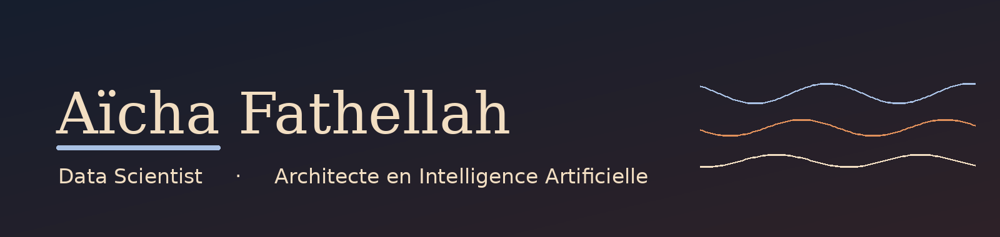

Office manager in the aerospace industry for four years, I have built technical expertise
in data science and artificial intelligence alongside my role.

Certified Data Scientist, trained as an AI Architect, with a focus on
designing robust, scalable and well governed AI systems.

---

## Training path

| Step | Programme | Status | Content |
|:--|:--|:--|:--|
| 01 | **Essentials** | Certified 2025 | Data exploration and cleaning (EDA), hypothesis testing, regression, classification, Random Forest, SQL |
| 02 | **Fullstack** | Certified 2026 | Big Data, Deep Learning, Computer Vision, NLP, Large Language Models and RAG, MLOps, ETL pipelines |
| 03 | **Concepteur Développeur en Science des Données** | Certified 2026 | Six competency blocks, from data infrastructure to leading data projects |
| 04 | **Architecte en Intelligence Artificielle** | Jedha certificate obtained, RNCP38777 (Level 7) exam in October 2026 | Data and AI governance, data architecture, data pipelines, industrialisation and deployment of AI solutions |

---

## Projects

My work is organised by training level, each project mapping to a competency block of the certification.

The four competency blocks of the AI Architect title.

| Block | Project | What it demonstrates |
|:--|:--|:--|
| Data and AI governance | **[Spotify Data Governance](https://github.com/AichaFa/3-Projets_Lead/tree/main/1_Spotify_Data_Governance)** | Maturity assessment, governance policy, RACI roles and a phased implementation roadmap |
| Data and compute infrastructure | **[Stripe - integrated data architecture](https://github.com/AichaFa/3-Projets_Lead/tree/main/2_Stripe_Business_Case)** | OLTP, OLAP and NoSQL architecture for a payment platform, with a real time change data capture pipeline (Debezium, Kafka, Airflow), fraud detection, product recommendation, security, compliance and Grafana supervision |
| Data pipelines | **[Automatic Fraud Detection](https://github.com/AichaFa/3-Projets_Lead/tree/main/3_Automatic_Fraud_Detection)** | Real time fraud detection pipeline: model training, deployment and monitoring, with an Airflow ETL ingesting a streaming payment API |
| Industrialisation and deployment | **[Medical Coherence Auditor](https://github.com/AichaFa/projet_final_ACM)** | Multimodal AI checking whether a radiology report is consistent with its chest X-ray, served end to end with a full MLOps chain: model registry, semantic drift monitoring and automated retraining |

| Block | Project | What it demonstrates |
|:--|:--|:--|
| Data infrastructure | **[Kayak](https://github.com/AichaFa/2-Projets-Fullstack/tree/main/1-Construire%20et%20g%C3%A9rer%20une%20infrastructure%20de%20donn%C3%A9es/Projet-Planifiez%20votre%20voyage%20avec%20Kayak)** | ETL pipeline feeding an AWS S3 data lake and PostgreSQL |
| Exploratory analysis | **[Speed Dating](https://github.com/AichaFa/2-Projets-Fullstack/tree/main/2-Analyse%20exploratoire%20des%20donn%C3%A9es/1-Speed%20Dating)**, **[Steam](https://github.com/AichaFa/2-Projets-Fullstack/tree/main/2-Analyse%20exploratoire%20des%20donn%C3%A9es/2-Steam)** | EDA on behavioural and gaming datasets |
| Machine learning | **[Walmart](https://github.com/AichaFa/2-Projets-Fullstack/tree/main/3-Apprentissage%20automatique/1-soldes%20Walmart)**, **[Conversion rate challenge](https://github.com/AichaFa/2-Projets-Fullstack/tree/main/3-Apprentissage%20automatique/2-d%C3%A9fi%20du%20taux%20de%20conversion)**, **[The North Face](https://github.com/AichaFa/2-Projets-Fullstack/tree/main/3-Apprentissage%20automatique/3-The%20North%20Face%20ecommerce)** | Regression, classification and unsupervised NLP |
| Deep learning | **[AT&T spam detector](https://github.com/AichaFa/2-Projets-Fullstack/tree/main/4-Apprentissage%20profond/D%C3%A9tecteur%20de%20spam%20AT%26T)** | Neural network for text classification |
| Deployment | **[Getaround](https://github.com/AichaFa/2-Projets-Fullstack/tree/main/5-Deploiement/getaround_project)** | Pricing optimisation served with MLflow, FastAPI and Streamlit |

**[Data scientist salaries 2025](https://github.com/AichaFa/1-Projets_Essentials)** - exploratory analysis and data storytelling on the drivers of data science salaries.

---

## Tech stack

### Languages and core tooling

| Tool  | What I use it for  |
|:--|:--|
|  | Main language across every project, from analysis to model training and deployment |
|  | Joins, aggregations, grouping and filtering on relational databases |
|  | Working environment for containers, clusters and remote instances |
|  | Automating tasks and driving infrastructure from the command line |
|  | Version control, branching and collaborative workflows |
|  | Hosting projects, code review and publishing a portfolio |
|  | Documenting repositories and writing project reports |
|  | Exploratory work, prototyping and documenting analyses |
|  | Cloud notebooks with free GPU access for training and prototyping |
|  | Main development environment |
|  | Isolating environments and pinning dependency versions per project |

---

### Data manipulation and analysis

| Tool  | What I use it for  |
|:--|:--|
|  | Loading, cleaning, reshaping and aggregating tabular data |
|  | Vectorised numerical computing, arrays and linear algebra |

---

### Visualisation and business intelligence

| Tool  | What I use it for  |
|:--|:--|
|  | Base plotting layer, fine control over figures for reports |
|  | Statistical charts, distributions and correlation views during EDA |
|  | Interactive charts embedded in notebooks and dashboards |
|  | Interactive browser based visualisations for larger datasets |
|  | Building analytical dashboards on top of model outputs |
|  | Data mining and business dashboards from multiple sources |

---

### Data collection, pipelines and orchestration

| Tool  | What I use it for  |
|:--|:--|
|  | Consuming REST APIs to collect external data |
|  | Asynchronous programming for concurrent data collection |
|  | Parsing and extracting content from HTML pages |
|  | Building structured web crawlers to collect data at scale |
|  | Connecting Python to databases and managing schemas from code |
|  | ELT connectors, deployed on Kubernetes |
|  | Orchestrating pipelines as scheduled, monitored workflows |
|  | Ingesting and processing streaming data in real time |
|  | Change data capture, streaming database changes in real time from the transaction log |
|  | Automating workflows between business applications |

---

### Databases and storage

| Tool  | What I use it for  |
|:--|:--|
|  | Relational storage for structured data and experiment tracking backends, including managed Postgres on Neon |
|  | S3 compatible object storage, used locally as a data lake and artifact store |
|  | Graph data science, modelling relationships as a network |
|  | Document database for semi structured data: schema validation, nested documents, GridFS and TTL indexes |

---

### Cloud

| Tool  | What I use it for  |
|:--|:--|
|  | Object storage for raw data and model artifacts |
|  | Managing access rights and credentials on cloud resources |
|  | Driving AWS services programmatically from Python |
|  | Remote compute instances, including GPU instances for training |
|  | Cloud data warehousing for analytical queries at scale |
|  | Training and deploying machine learning models in the cloud |
|  | Cloud storage services and building a data lake |

---

### Big data and distributed computing

| Tool  | What I use it for  |
|:--|:--|
|  | Processing datasets too large for a single machine, with RDDs, DataFrames and Spark SQL |
|  | Python interface to Spark for large scale data processing |
|  | Managed Spark workspace for distributed analysis and notebooks |
|  | Foundational concepts of distributed storage and computation |
|  | Distributing Python workloads across a cluster, with Ray Train and Ray Tune |

---

### Machine learning

| Tool  | What I use it for  |
|:--|:--|
|  | Preprocessing pipelines, regression, classification, clustering, PCA, model selection and evaluation |
|  | Gradient boosted trees on structured data |
|  | Fast gradient boosting, an alternative for large tabular datasets |
|  | Time series forecasting with trend and seasonality components |
|  | Hyperparameter optimisation, used as a search strategy inside Ray Tune |

---

### Deep learning

| Tool  | What I use it for  |
|:--|:--|
|  | Building and training neural networks, including CNNs, RNNs and multimodal architectures |
|  | Alternative deep learning framework |
|  | High level API for assembling and training models quickly |
|  | Image datasets, transforms and pretrained convolutional backbones for transfer learning |
|  | Storing and loading model weights in a safe, portable format, independent of the Python version |

---

### Natural language processing

| Tool  | What I use it for  |
|:--|:--|
|  | Tokenisation, lemmatisation and linguistic preprocessing of text corpora |
|  | Classic NLP toolkit for stopwords, stemming and corpus handling |
|  | Topic modelling and word embeddings on unlabelled text |
|  | Pretrained transformer models, embeddings and fine tuning |

---

### Large language models and RAG

| Tool  | What I use it for  |
|:--|:--|
|  | Building LLM applications end to end: document loaders, recursive text splitters, retrievers, chains composed with LCEL, memory, tools and agents including a SQL agent |
|  | Vector database for storing embeddings and running similarity search, run both as a managed cluster and locally in Docker |
|  | Generating sentence embeddings to populate the vector store |
|  | Chat model used as the generation step of the retrieval chain |
|  | Fine tuning open source language models and evaluating the result |
|  | Serving language models in production with high throughput |
|  | Publishing fine tuned models, and pulling pretrained models and tokenizers |

Applied to retrieval augmented generation over a knowledge base, a research assistant,
and a customer success assistant served end to end.

---

### Reinforcement learning

| Tool  | What I use it for  |
|:--|:--|
|  | Distributed reinforcement learning built on top of Ray |
|  | Building and customising reinforcement learning environments |

---

### MLOps, deployment and infrastructure

These tools make up the MLOps stack I work with across testing, continuous integration
and deployment, continuous training and continuous monitoring.

| Tool  | What I use it for  |
|:--|:--|
|  | Packaging applications into reproducible images that run identically anywhere |
|  | Orchestrating containers across a cluster, with declarative manifests and self healing |
|  | Packaging and versioning Kubernetes deployments, with upgrades and rollbacks |
|  | Tracking experiments, parameters, metrics and artifacts, serving a model registry, and running a tracking server backed by Hugging Face |
|  | Exposing models through documented REST APIs |
|  | ASGI server running FastAPI applications in production |
|  | Turning models into interactive web applications |
|  | Building interactive model demos, deployed on Hugging Face Spaces |
|  | Hosting containerised applications and model demos publicly |
|  | Quick web hosting for applications |
|  | Structuring test suites with fixtures, parameterized tests, markers and edge case coverage on data, code and models |
|  | Comprehensive data validation with structured expectations and detailed quality reports |
|  | Automating tests, builds and deployments on every commit, and triggering retraining pipelines |
|  | Alternative automation server for building CI/CD pipelines |
|  | Monitoring models in production, detecting data and prediction drift |
|  | Dashboards and alerting for real time infrastructure and model supervision |

Data validation also relies on the `pandas.testing` module for quick schema and dtype checks
during development, with Great Expectations reserved for production grade validation.
Training and monitoring pipelines are orchestrated with **GitHub Actions**, and also with **Airflow** DAGs.

---

## Contact

---

> *"The goal of data is not to answer questions, but to help you ask better ones."*
